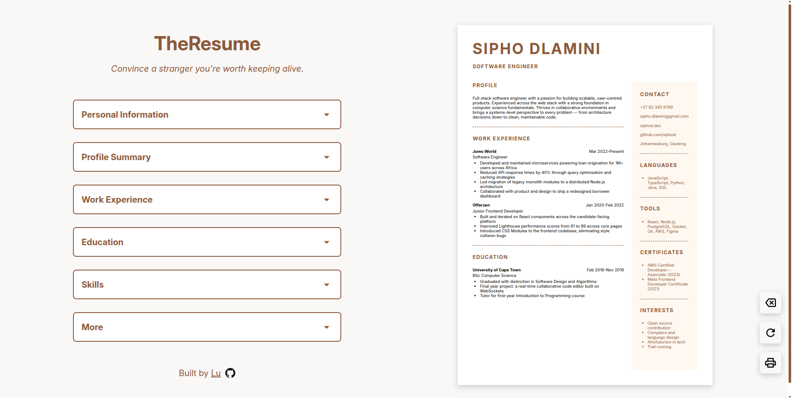
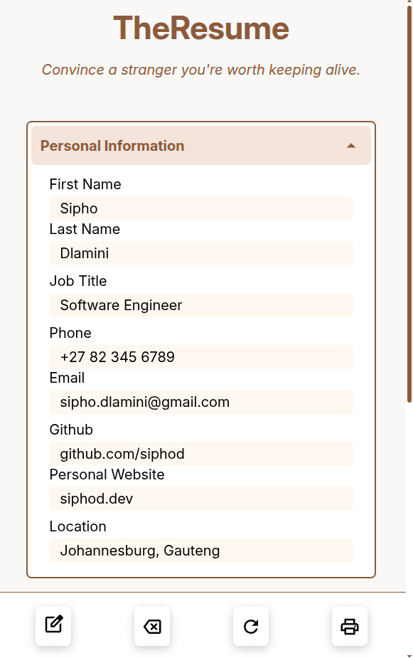
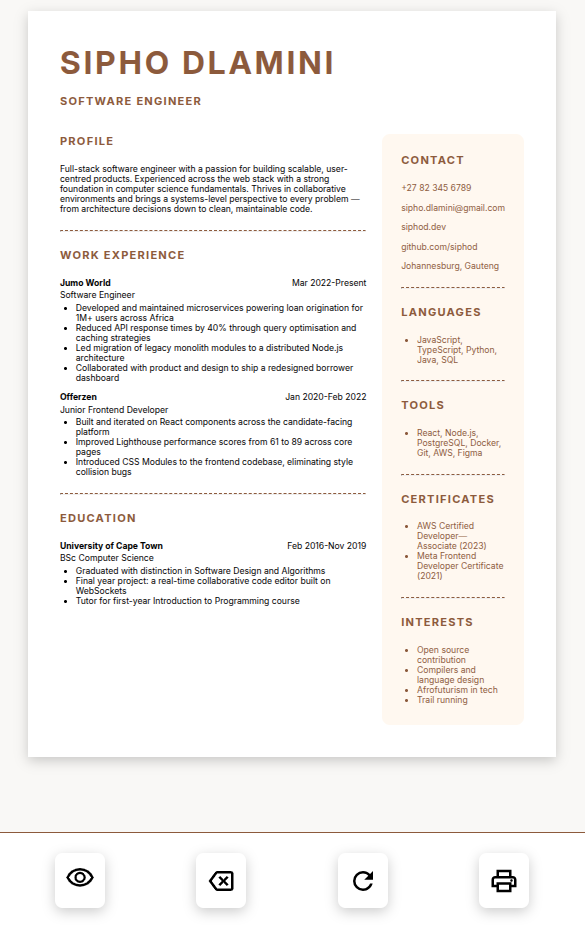

# TheResume — CV Generator

A responsive, real-time CV generator built with React. Fill in your details and watch your CV take shape instantly — then print it, clear it, or load a default profile to get started.

---

## 🔗 [Live Site](https://theresumecvgen.netlify.app/)

---

## 📷 Demo

<p align='center' >
    
</p>

<p align='center' >
    
</p>

<p align='center' >
    
</p>

---

## 📄 Features

**Real-Time Preview:**

- CV updates instantly as you type with no need to submit or refresh
- Input fields and CV preview are displayed side by side
- Changes across all sections — personal details, work experience, education, and custom sections — are reflected immediately

**Print:**

- Exports the CV preview directly to PDF via the browser's native print dialog
- Print styles are scoped to the CV preview, omitting the editor interface from output

**Clear:**

- Resets all input fields and sections back to a blank state in a single action
- Wipes all sections uniformly including custom user-defined sections

**Default Values:**

- Populates the entire CV with a pre-built default profile at the click of a button
- Useful as a starting point or reference for how each section should be filled in

## 🧰 Tech Stack

[](https://skillicons.dev)

---

## ⚙️ Installation

```bash
git clone https://github.com/your-username/billable.git
cd billable
npm install
npm run dev
```

---

## 💬 Acknowledgements

- Color palette: [Color Hunt](https://colorhunt.co/)
- Icons and fonts: [Google fonts](https://fonts.google.com/)